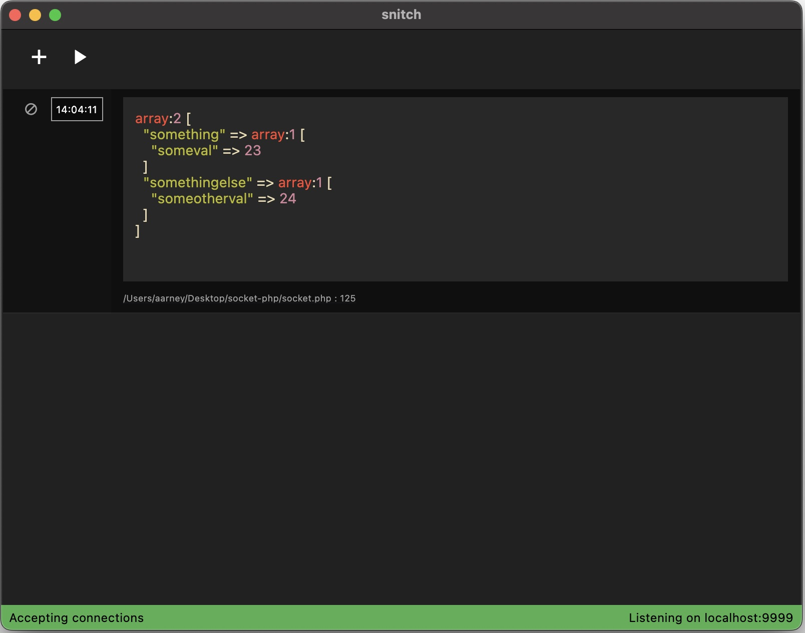

# Snitch

An application to display debug logs via a socket connection.



## Usage

To send data to the app, open a socket connection to `localhost:9999` and write data to it.

The app will display any data you send it, but if you want syntax highlighting you should send it as JSON in the following schema.

```json
{
  "origin": {
    "file": "path/to/file",
    "lineNumber": 23,
    "hostname": "my-computer.local"
  },
  "language": "dart",
  "value": "json-stringified-values"
}
```

To send commands to the app you can add the `command` key to the JSON, passing it the command to execute. Note that you can't pass arbitrary commands as they won't be recognized.

```json
{
  "command": "clear"
}
```